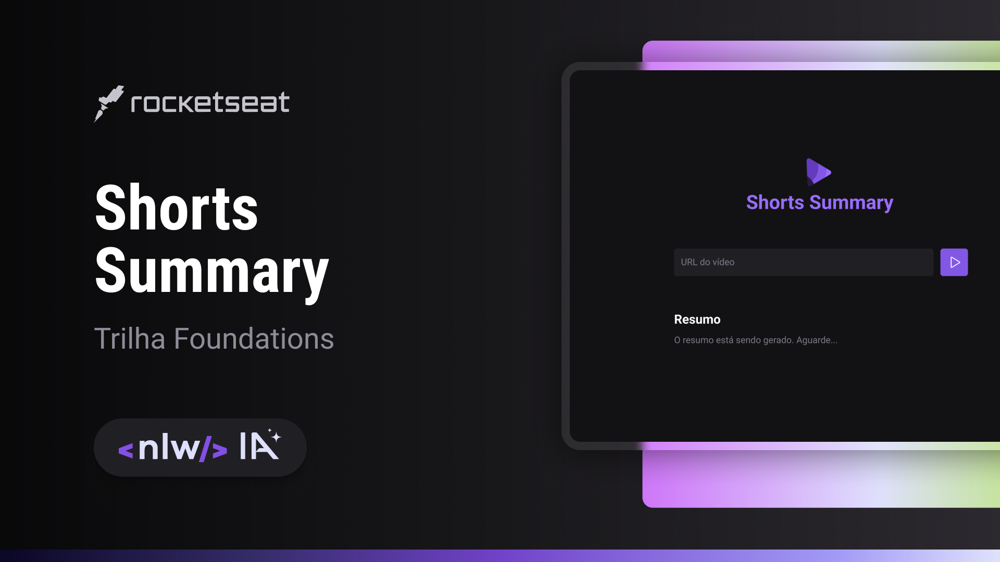

# NLW IA - SHORTS SUMMARY - FOUNDATIONS 

Shorts Summary é uma aplicação web para criar resumo de vídeos shorts do Youtube utilizando Inteligência Artificial para transcrever o conteúdo do vídeo e realizar o resumo do conteúdo. Esse projeto é desenvolvido na trilha Foundations na edição NLW IA.

# NLW IA - SHORTS SUMMARY - FOUNDATIONS 

- Projeto de cartão desenvolvido pela rocketseat 

> NLW IA - SHORTS SUMMARY - FOUNDATIONS 

👉🏼[Link do projeto]()

#  💻🔧 Tecnologias

- HTML
- CSS
- JavaScript
- Git
- Git Hub

## Contato 💻

juniorjose1925@gmail.com

https://www.linkedin.com/in/jose-martinez-352032222/
